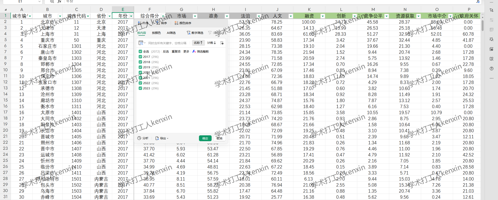
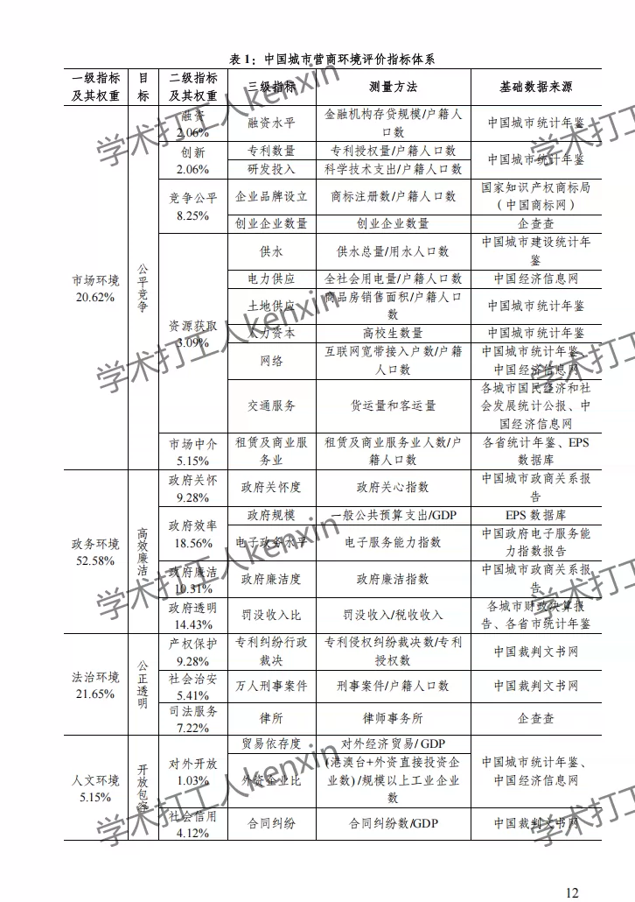
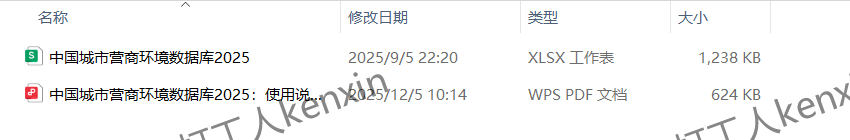

## Body

The "China Urban Business Environment Assessment Database 2025" provides annual business environment data for cities at the prefectural level and above from 2017 to 2023, including total scores, four primary indicator scores, twelve secondary indicator scores, and twenty-three tertiary indicator scores.

## Images

item_954087407495

Here is a pay link on Stripe ( https://buy.stripe.com/3cs8yP7sY87d0vu9AB ). Please contact me lonlonago@foxmail.com after funding $89, and I will send you a complete data files , thank you!

